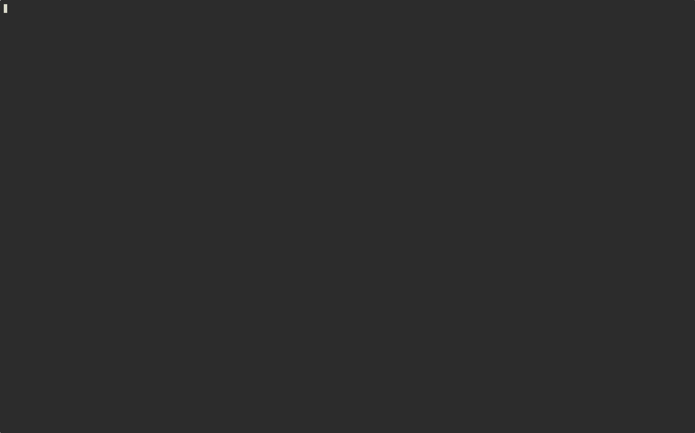

# tcode

A terminal-based coding agent powered by neovim and tmux.

<p align="center">
  
</p>

## Features

- **Built on neovim and tmux**. Your keybindings, plugins, and muscle memory carry over.
  - Tree-sitter syntax highlighting and render-markdown support in the display pane
  - Configurable tmux pane layout (display, edit, tree, permissions — arrange however you like)
- **Subagent tree view** — see all subagents and tool calls in a live hierarchy, open any subagent's conversation, cancel running ones
- **Permission dashboard** — see every permission the agent currently has at a glance, approve or revoke individually, with session and project-level persistence
- Headless Chrome for web search and web fetch — log in with your own accounts (Kagi, Google, etc.)
- Token usage tracking per conversation and subagent
- **Powered by llm-rs**, a standalone LLM library built from scratch for this project:
  - Provider-agnostic trait with streaming — currently supports Claude, OpenAI, and OpenRouter
  - `#[tool]` proc macro for defining tools from plain function signatures
  - Conversation manager with multi-turn subagents and cancellation

### Features on Roadmap

* Conversation branching.
* Conversation compacting.
* More provider supports, like Gemini, Codex subscription etc.


## Quick Start

Install the latest release:

```sh
curl -sSL https://raw.githubusercontent.com/wb14123/tcode/refs/heads/master/install.sh | sh
```

Then follow the [Getting Started](docs/01-getting-started.md) guide for prerequisites, configuration, and a walkthrough of the UI.

More user docs:

- [Configuration](docs/02-configuration.md) — config file reference, providers, layout, shortcuts
- [Commands](docs/03-commands.md) — full CLI reference
- [Keybindings](docs/04-keybindings.md) — display, edit, tree, and permission views
- [Neovim Setup](docs/05-neovim.md) — render-markdown, tree-sitter, plugin compatibility
- [Browser Setup](docs/06-browser.md) — Chrome setup for web tools
- [Permissions](docs/07-permissions.md) — permission system, scopes, and config

## Crate Map

Each crate has its own README with architecture and developer documentation.

- [**tcode**](tcode/) — Terminal application — server, display, edit, tree, permission clients
- [**llm-rs**](llm-rs/) — Core library — LLM provider abstraction, conversation management, tools, permissions
- [**llm-rs-macros**](llm-rs-macros/) — Proc macros for tool definitions (`#[tool]` attribute)
- [**tools**](tools/) — Built-in tool implementations (web_search, web_fetch API clients)
- [**browser-server**](browser-server/) — Headless Chrome server for web search/fetch (REST API over Unix socket or TCP)
- [**tree-sitter-tcode**](tree-sitter-tcode/) — Tree-sitter grammar for tcode conversation format
- [**lsp-client**](lsp-client/) — LSP client for code intelligence tools
- [**auth**](auth/) — OAuth authentication

## Building

```bash
cargo check           # Quick type checking
cargo build           # Debug build
cargo test            # Run tests
cargo fmt             # Format code
cargo clippy          # Lint code
```

Run `cargo fmt` and `cargo clippy` after each change to ensure consistent formatting and catch common issues.

## Releasing

Requires [`cargo-release`](https://github.com/crate-ci/cargo-release): `cargo install cargo-release`.

```sh
# Bump version in all workspace Cargo.toml files, commit, tag, and push:
cargo release 0.2.0 --execute
```

This creates a `v0.2.0` tag and pushes it. GitHub Actions then builds binaries for all 4 platforms and publishes a GitHub Release (~10 minutes).

## Uninstall

```sh
# System install:
sudo rm /usr/local/bin/tcode /usr/local/bin/browser-server /usr/local/lib/libtree-sitter-tcode.*
# User install:
rm ~/.local/bin/tcode ~/.local/bin/browser-server ~/.local/lib/libtree-sitter-tcode.*
```
